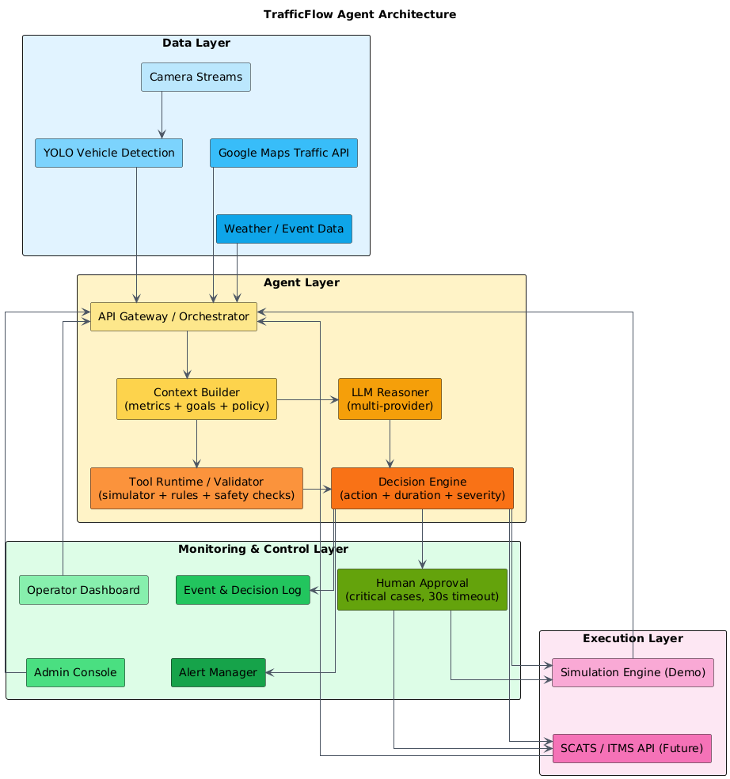

# TrafficFlow Agent

> Autonomous AI System for Smart Traffic Signal Control — GDGoC Hackathon Vietnam 2026

## Overview

**TrafficFlow Agent** is an autonomous AI agent that uses real-time camera feeds and Google Maps data to detect traffic congestion using a hybrid method (density + speed + queue length), leverages multi-provider LLMs (Groq / OpenRouter / Alibaba Qwen) to make optimal traffic signal adjustment decisions at busy intersections in Ho Chi Minh City (Truong Chinh – Cach Mang Thang 8).

**Theme:** "Agents of Change" — Agentic AI for Smart Traffic Management

## Project Structure

```
agent-traffic/
├── docs/
│   ├── proposal_template.md          # Template proposal (reference)
│   ├── proposal.md                   # Final proposal for Stage 1
│   ├── architecture.md               # System architecture (Mermaid diagrams)
│   └── plans/
│       ├── traffic-agent-design.md
│       └── traffic-agent-implementation-plan.md
├── traffic-sim/                      # Next.js simulation & dashboard
│   ├── app/
│   └── ...
├── hackathon.md                      # Hackathon rules & criteria
├── proposal.tex                     # LaTeX source for PDF proposal
└── README.md
```

## Tech Stack

| Layer | Technology |
|---|---|
| **AI Agent** | Groq / OpenRouter / Alibaba Qwen (multi-provider LLM) |
| **Agent Framework** | LangChain / LangGraph |
| **Object Detection** | YOLO v8 |
| **Map Data** | Google Maps Traffic API + OSRM |
| **Frontend** | Next.js 14+ (App Router) + React + Tailwind CSS |
| **Simulation** | Custom web engine (Canvas/SVG) |
| **Cloud** | Google Cloud Platform |

## Agent Architecture



```text
Camera (YOLO) + Google Maps
        │
        ▼
Congestion Detector
        │
        ▼
LLM Reasoner (multi-provider)
        │
        ▼
Decision Engine
        │
        ├── Simulation Engine (Demo)
        ├── SCATS/ITMS API (Future)
        └── CSGT Dashboard (Monitoring)
```

## Agent Decision Loop

1. **OBSERVE** — Camera + Maps → metrics (density, speed, queue)
2. **REASON** — LLM analyzes situation → proposes adjustment
3. **DECIDE** — Normal (auto-apply) / Warning (alert) / Critical (human approval)
4. **ACT** — Apply signal change
5. **FEEDBACK** — Re-observe → loop

## Key Features

- **Hybrid Congestion Detection** — Camera (YOLO) + Google Maps for maximum accuracy
- **LLM-Powered Reasoning** — Multi-provider LLM with clear reasoning chain
- **Human-in-the-Loop** — CSGT dashboard with approval for critical cases
- **A/B Test Evaluation** — Compare baseline vs agent to measure effectiveness

## Hackathon Stages

- [x] **Stage 1: Proposal** — `docs/proposal.md` + `proposal.tex`
- [ ] **Stage 2: Prototype** — `traffic-sim/`
- [ ] **Stage 3: Final Demo**

## Build PDF from LaTeX

```bash
# Install pdflatex (on Windows, use MiKTeX or WSL)
pdflatex proposal.tex
# Output: proposal.pdf
```

## Team

> [!IMPORTANT]
> Team information needs to be filled in. See `docs/proposal.md` for details.

## References

- [GDGoC Hackathon Vietnam 2026](https://gdg.community.dev/gdgoc-hackathon-vietnam-2026/)
- [LangChain Documentation](https://docs.langchain.com/)
- [YOLO v8](https://docs.ultralytics.com/)
- [Google Maps Traffic API](https://developers.google.com/maps/documentation/traffic)
- [Groq API](https://console.groq.com/docs)
- [OpenRouter](https://openrouter.ai/docs)
