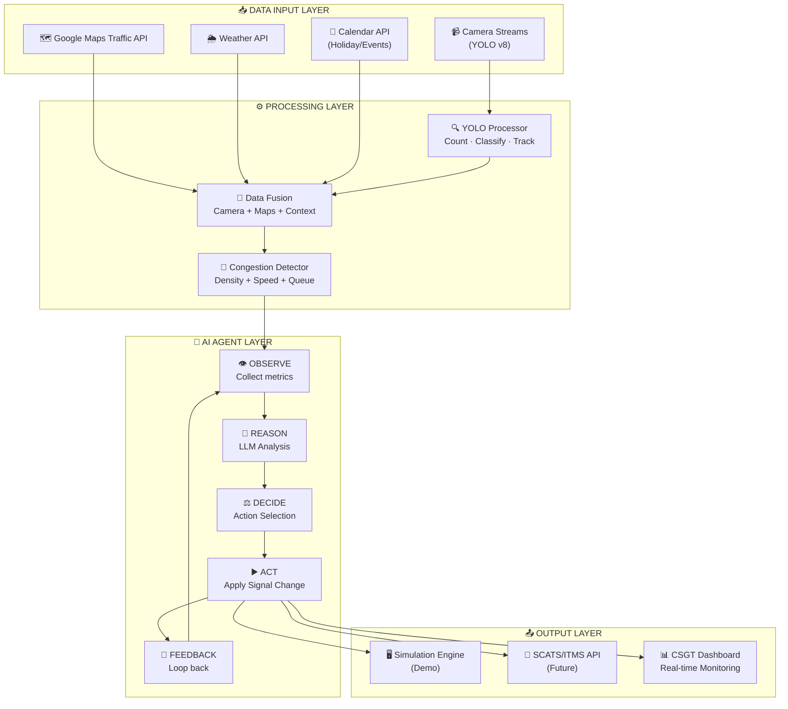
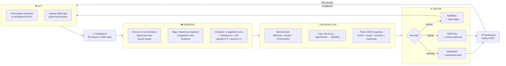
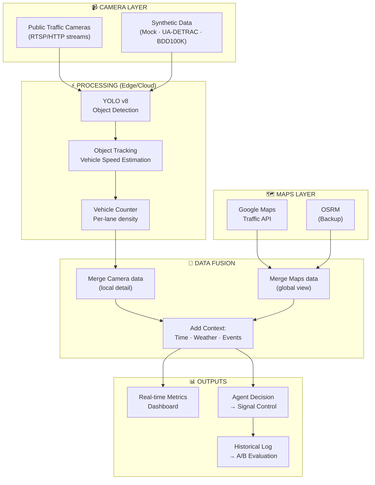
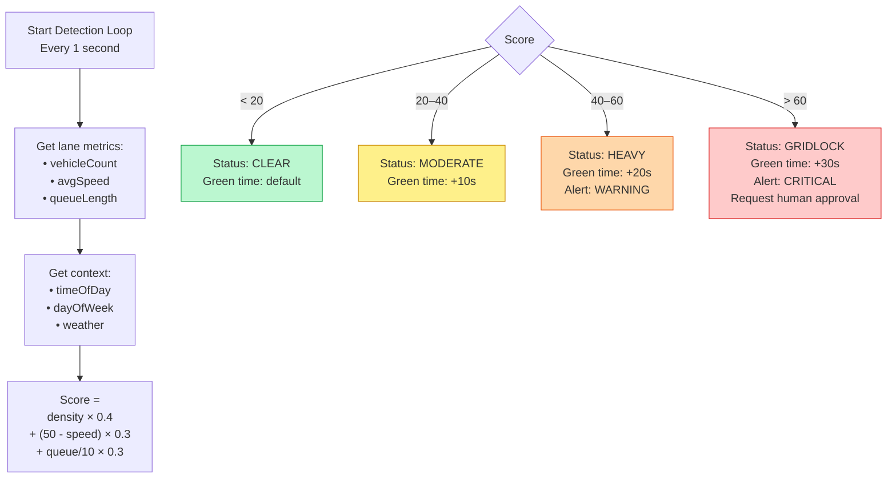
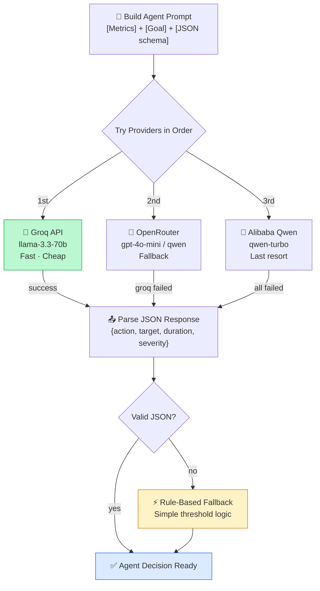
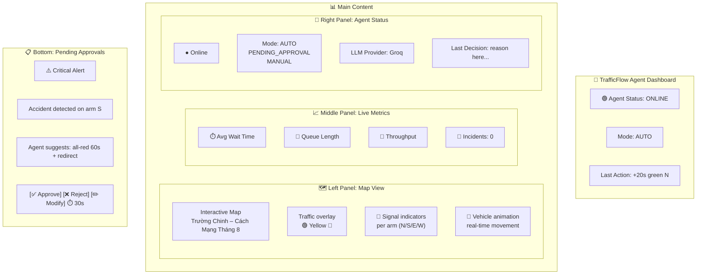
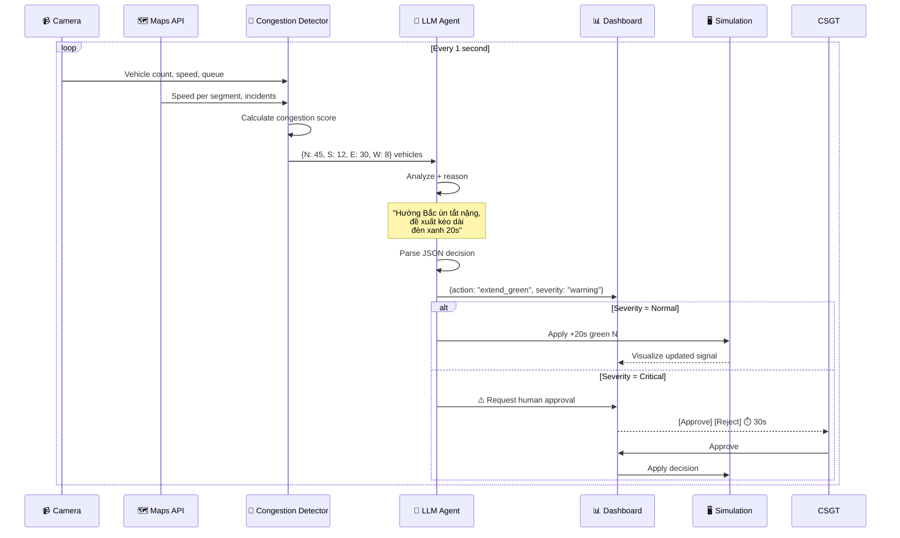
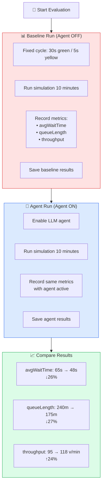
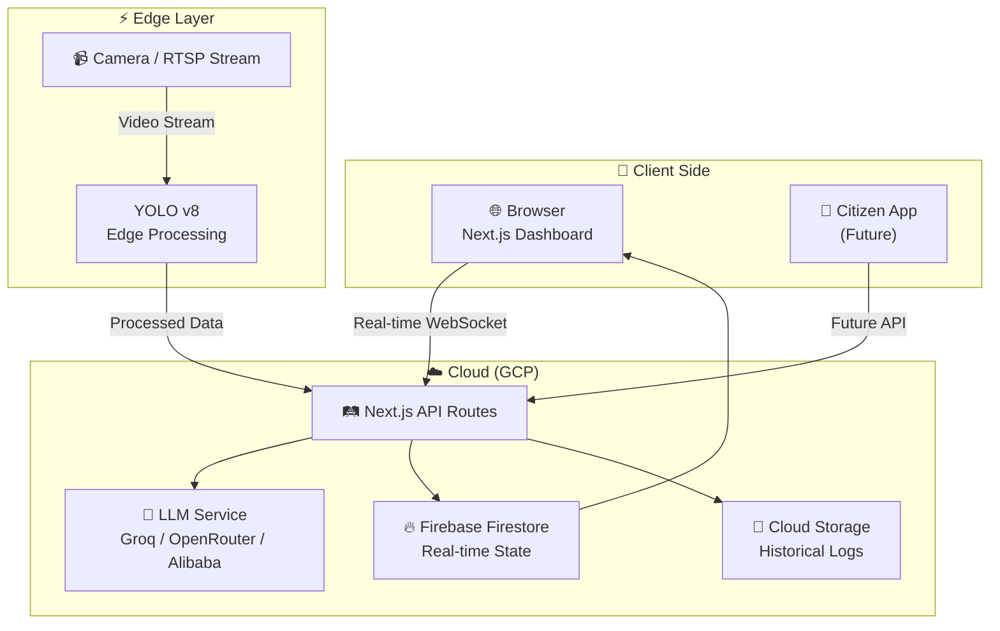

# TrafficFlow Agent — System Architecture

> Mermaid diagrams for GDGoC Hackathon Vietnam 2026 | Stage 1: Proposal

---

## 1. High-Level System Architecture

---

## 2. Agent Decision Loop (Core Agentic Cycle)

---

## 3. Data Flow Architecture

---

## 4. Congestion Detection Algorithm

---

## 5. LLM Multi-Provider Architecture

---

## 6. Dashboard Layout

---

## 7. Sequence Diagram: Agent Decision Process

---

## 8. A/B Test Evaluation Flow

---

## 9. Deployment Architecture

---

*Architecture diagrams: 2026-03-24*
*Project: TrafficFlow Agent — GDGoC Hackathon Vietnam 2026*
